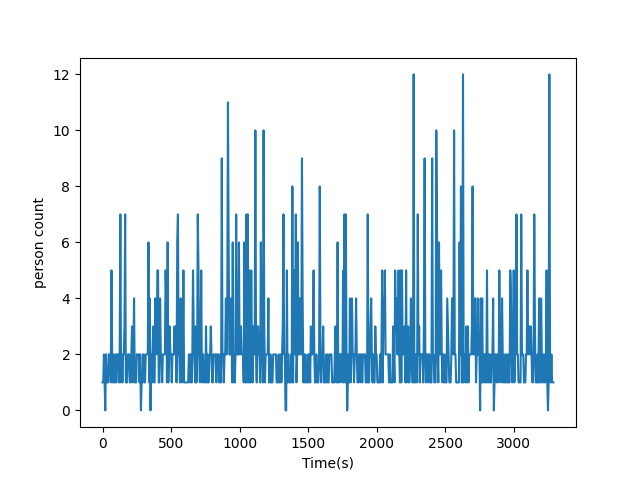

# 機能説明
動画内に映る人数を経時的にカウントできる。
 
 
ユーチューブのリンクを設定することで、ダウンロードから実行可能。
 
 
出力はグラフ画像。
（縦軸：人数、横軸：経過時間）

# 環境構築
以下インストールが必要
 
 
!pip3 install ultralytics
 
 
!pip3 install torch torchvision torchaudio
 
 
!pip install yt-dlp

